[portfolio](https://pheelip-portfolio.vercel.app/) &nbsp;·&nbsp;
[linkedin](https://www.linkedin.com/in/pheelip-raipure-1b66332b5/) &nbsp;·&nbsp;
[leetcode](https://leetcode.com/u/i9MnaIN7LJ/) &nbsp;·&nbsp;
[email](mailto:pheelipraipure@gmail.com)

> B.Tech in AI & Data Science at IIIT Sri City. 
> Building reliable, user-focused software at scale.

I build end-to-end applications from React frontends to scalable 
REST/WebSocket backends and XR experiences. Currently focused on 
real-time communications, distributed systems, and backend architecture.

<samp>c++ &nbsp; python &nbsp; javascript &nbsp; react &nbsp; node.js &nbsp; fastapi &nbsp; postgresql &nbsp; webrtc &nbsp; unity</samp>

**[Hangout](https://hangout-pheelips-projects.vercel.app)** &nbsp;·&nbsp; <samp>react, express, webrtc, prisma</samp> 
Real-time video meeting platform with WebRTC signalling, TURN relay 
fallback, concurrent WebSocket room management, and split-domain deployment.

**[UrQuest](https://ur-quest.vercel.app)** &nbsp;·&nbsp; <samp>python, fastapi, postgresql, sqlalchemy</samp> 
Gamified task platform serving multiple concurrent organizations. 
Features org-based RBAC, custom roles, XP levelling, and live leaderboards.

**TiltFit: VR Exergaming** &nbsp;·&nbsp; <samp>unity, c#, meta quest 3</samp> 
Controller-free VR exergame using body-proportional HMD thresholds to 
kinematically verify squats and lunges. Accepted as IEEE ISMAR 2026 poster.

Every graphic here is generated, not embedded from anyone else's server. 
`ascii.svg` is a photo pushed through a character ramp by 
[`scripts/make_portrait.py`](scripts/make_portrait.py); the stat graphics and 
these section headings are drawn by [a scheduled action](.github/workflows/stats.yml) 
straight from the GitHub GraphQL API, once a day, committing only what changed.

They animate with SMIL inside the SVG, because GitHub strips scripts from 
READMEs — and since nothing loads from a third party, nothing here can 
rate-limit or go dark. The headings are SVGs for the same reason: GitHub also 
strips CSS, so an image is the only way to put this page's own typeface on them.

The typeface is [JetBrains Mono](scripts/fonts), subset to just the characters 
each graphic draws and inlined as base64. That isn't only for looks: the 
portrait's grid assumes an advance width of exactly 0.600 em, and a viewer whose 
default monospace is narrower would otherwise see it squeezed.

Language totals cover public repositories only. `year.svg` uses the portrait's 
character ramp: `:` `+` `#` `@`, quiet to loud.
